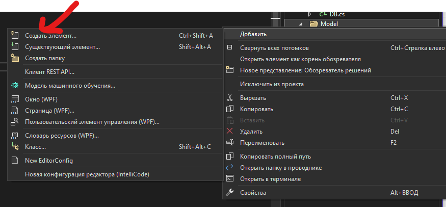
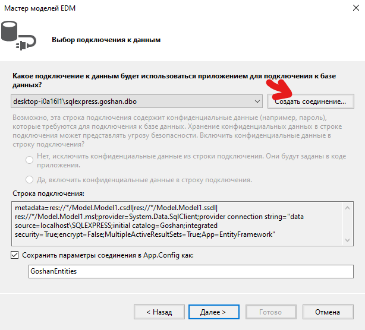

<!-- PROJECT INFO -->
 

  <h1>
    SchoolShopProject
  </h1>
  <ol>
    Проект представляет собой магазин школьных принадлежностей для изучения иностранных языков.
  </ol>

## Начало работы

Для установки скачайте необходимую версию с [https://github.com/NeGaPuPe/DemoSrez]

(<a href="#readme-top">Наверх</a>)

## Необходимые условия

Для использования данного ПО неодходимо:
<ol>
    <li>Операционная система Windows 10.</li>
    <li>Visual Studio 2022.</li>
    <li>MS Sql Server 2019.</li>
  </ol>

(<a href="#readme-top">Наверх</a>)

## Установка
<ol>
    <li>Для начала переходим по ссылке указанной в пункте «Начало работы».</li>
    <li>Скачиваем необходимую версию приложения из репозитория.</li>
    <li>Скачиваем бэкап базы из репозитория.</li>
    <li>Запускаем SQL Managment Studio и делаем импорт скаченной базы.</li>
    
    
    <li>Откываем скаченный проект через Visual Studio.</li>
    <li>Изменяем пути до фотографий на свои.</li>
    
    <li>Удаляем старую строку подключения к БД.</li>
    
    <li>Удаляем старую модель БД.</li>
    
    <li>Теперь создаём новую модель данных БД.</li>
    
    
    
    
    
    
    
    <li>Всё, теперь можно запускать приложение и пользоваться им.</li>
</ol>

(<a href="#readme-top">Наверх</a>)

